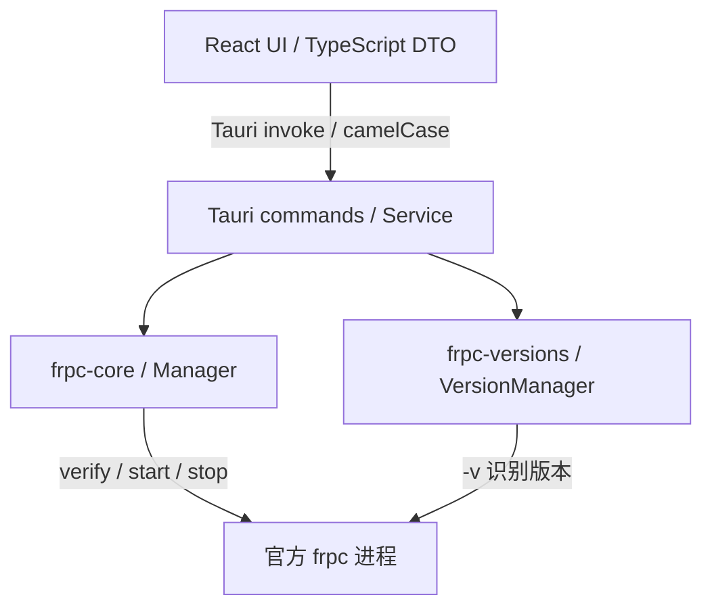

# 桌面实现架构

2026-10-08。当前实现为 Windows 优先的 Tauri 2 桌面客户端；React 原型单独保留。官方 frpc 负责 frp 协议、认证、连接与转发，Rust 负责配置、版本库及进程生命周期。

## 模块与依赖

两个 Rust 领域 crate 不依赖 Tauri，也不彼此依赖。宿主组合二者：启动前由 versions 校验并解析二进制路径，再交给 core 运行。前端不能指定运行程序路径或任意 shell 命令。`prototypes/frpc-ui` 不依赖生产应用，也不参与桌面构建。

| 模块 | 职责与对外入口 |
| --- | --- |
| `frpc-core` | camelCase DTO、八种协议及高级配置生成/验证、原子配置保存、逐连接启停/应用、进程日志与状态；`Manager` |
| `frpc-versions` | GitHub 官方发布、平台资产匹配、SHA-256、安全解压/原子安装、本地导入及完整性校验；`VersionManager` |
| versions `migration` | 显式目录、只读 NeDB 日志重放、转换 JSON DTO、未支持字段检查和源指纹；无 core/Tauri 依赖 |
| Tauri `Service` / commands | 领域组合、批量结果、配置/版本关联锁、迁移领域验证、自动启动插件与系统行为 |
| React `desktop.ts` / `store.ts` | typed invoke、宿主识别、串行保存、权威快照接收、过期响应保护、状态轮询 |

## 配置与存储决定

早期本机单用户管理采用 `schemaVersion: 1` JSON，而非数据库或 ORM。当前主要操作是小规模连接/隧道集合的完整一致性保存，不需要关系查询或多进程写入；JSON 便于检查、备份、迁移，也避免引入额外运行依赖。跨实体校验集中在领域层，后续出现大量历史记录、复杂查询或多进程需求再重新评估数据库。

保存流程为复制当前配置、应用变更、完整验证、同目录写临时文件并 flush/sync、原子替换 `state.json`，最后发布内存状态。保存失败保留原文件及内存配置。未知 schema 或损坏文件明确失败，不用空配置覆盖。保存时剥离运行标记；加载后所有连接停止/未确认，隧道待应用，避免将上次进程状态当作事实。

连接与隧道以缺省为空的 `advanced` 对象承载官方嵌套参数，基础字段仍是唯一基础来源；未知键、错误类型、版本或协议不适用项明确拒绝。前端编辑器、交换校验和版本库清单共用 `configCapabilities.ts`，Rust 校验遵循相同的官方版本门槛。连接采用所选版本，隧道采用所属连接版本；版本切换保留已有不兼容值并提示，禁止静默删除。可选项未填写时不固化官方默认值。详见 [高级配置契约](advanced-config-contract.md)与 [逐版本清单](../frpc-version-configuration.md)。

表单通过 `configDefaults.ts` 展示对应完整版本和当前上下文的官方默认值，未触碰的高级项不会因渲染写入模型。用户修改才形成明确覆盖，恢复默认移除覆盖；TCP 复用等上下文变化会同步未设置项的显示。字段能力可继承同 minor，默认行为必须单独核对补丁。应用接管的日志/监督策略明确区别于官方默认，环境代理来源和必填后端目标不编造固定值。

数据目录由 Tauri `app_data_dir()` 决定，在设置页显示：

- `state.json`：连接、隧道、设置；包括当前明文 token 和隧道密钥。
- `versions/<version>/`：当前平台 frpc、安装清单、固定二进制 SHA-256 和来源。
- `runtime/`：由 core 生成的临时 TOML，进程退出时清理；含运行所需凭据。

开发调试构建可用 `FRPC_UI_DATA_DIR` 指向隔离测试目录；发行构建不采用此覆盖。后端日志有界保留于内存，前端展示最近的有界窗口，尚无磁盘历史日志。系统凭据库/加密存储尚未接入。

## 进程与状态

core 按连接串行化生命周期操作。启动生成临时 TOML，运行官方 `frpc verify -c <path>`；验证通过后启动客户端。应用配置采用先验证、再停止旧子进程并启动新子进程，避免依赖旧项目的相对路径 reload。应用过程会短暂断开流量。

`process`、`connection` 与隧道 `apply` 分开记录：进程存活不代表服务器登录成功，登录成功也不代表全部隧道注册成功。状态来自监督任务与 frpc 日志回执。配置修订及进程 generation 防止旧进程日志覆盖新状态。日志进行凭据脱敏，并限制行长和缓存量。

Windows 子进程隐藏控制台，停止路径发送停止信号并等待退出，超时则终止托管子进程；异常退出更新状态。应用关闭可以隐藏至托盘；退出期间阻止新运行操作，等待 core shutdown 完成后退出。单实例、托盘与系统启动位于 Tauri 宿主，不进入领域模型。

## IPC 与异步一致性

完整命令与例外返回值见 [IPC 契约](ipc-contract.md)。保存命令返回 `{profiles,tunnels,logs,settings,versions,dataDir}`，运行命令返回逐连接结果与快照，迁移预览返回 DTO、问题、警告及源指纹。

前端以 Rust 返回值更新持久配置，保存失败保留表单；不会提前写入模拟成功状态。常规写操作串行排队，revision 防止旧轮询覆盖新保存。每秒读取快照；运行和下载期间允许轮询，便于看到真实进程日志和下载进度。后端锁保护连接配置与版本删除的关联，快照读取不等待下载网络操作。

前端通过 `isTauri()` 区分宿主。直接访问 Vite 的 5188 端口使用独立 browser mock store；不执行 Rust 命令，不持久化桌面凭据。该模式用于界面检查，不能作为真实隧道验收。

## 二进制与迁移边界

官方版本刷新使用 fatedier/frp GitHub Releases API，过滤稳定版并匹配当前平台资产。下载优先采用 GitHub asset SHA-256 digest，缺失时读取官方 checksum 清单；无可用校验值则拒绝安装。限制下载/解压大小、条目数量与超时，拒绝路径穿越和链接，只提取预期 frpc；运行 `-v` 验证版本后原子安装。每次启动重新校验已固定的二进制 SHA-256。

本地导入在原生选择路径后复制到隔离暂存目录，运行 `-v` 并保存本地 SHA-256。该 hash 检测后续文件变化，不构成官方来源认证。版本删除检查所有连接引用；运行、启动或停止中的连接不能更换版本，避免旧二进制失去占用保护。删除通过同父目录原子 rename 提交为隐藏目录，再清理文件；rename 失败不改变安装，清理失败的隐藏残余不阻断下次启动。版本路径始终由后端管理。

旧迁移只读用户明确选择的 `server-v2.db` 与 `proxy-v2.db`，逐行重放更新/删除并忽略索引元数据；坏行不做部分导入。只接受旧单连接的唯一有效服务器记录。确认时重新读取并比较两文件内容 fingerprint，验证 core DTO，新增连接及隧道，生成新 ID 并避让管理端口。旧自动连接/系统启动偏好不应用，未知或未支持的非默认配置阻止导入。

现代模型明确限定配置子集；拒绝未知字段，不默默删除配置。完整协议数据面、多平台安装器、凭据加密与自动更新不属于已验收范围，见 [验证记录](verification.md)。
