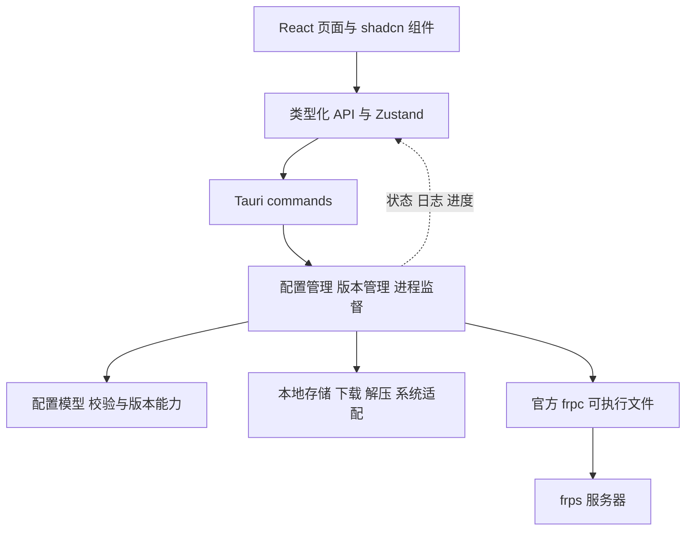

# frpc-ui Rust 重写评估

使用 Rust 重写 `frpc-desktop` 的桌面宿主和管理后端可行。结合用户指定的 scoopUI 技术栈，建议采用 **Tauri 2 与 Rust 后端，React 19 与 shadcn/ui 前端，继续运行官方 frpc 二进制**。用户明确要求根据旧功能整体重新设计 UI，并新增多连接与批量维护。旧源码用于识别行为规则，页面布局不沿用。

本评估日期为 2026-10-08。用户已确认 UI 技术路线、配色与基础组件参考 scoopUI，以及多连接和高密度批量维护方向，并随后要求开始开发。第一版 Tauri/Rust 实现已落地于 `apps/desktop` 和 `crates/`，初版采用本地原子 JSON 存储，面向 Windows x64；`prototypes/frpc-ui` 保留为设计原型。当前实现和验证范围见[架构说明](development/architecture.md)与[验证记录](development/verification.md)。以下源码分析、迁移风险与工期属于初始评估，不能代替实际完成状态。

## 项目基线

| 项目 | 本地路径 | 版本与状态 |
| --- | --- | --- |
| 新项目 | `D:\Work\dawi\frpc-ui` | 已初始化 `main`，`origin` 为 `https://github.com/nvrenshiren/frpc-ui.git`；远程检查时为空，尚无提交 |
| 功能参考 | `D:\Work\frpc-desktop` | HEAD `1d244e0`，应用 `1.2.2`；Electron 29、Vue 3、Element Plus、Pinia、Vite 5 |
| UI 技术参考 | `D:\Work\dawi\scoopUI` | HEAD `5818fde`，应用 `0.1.11`；Tauri 2、Rust 与 React；已有 Cargo.lock 本地修改，未触碰 |

旧项目主要 TS 与 Vue 源码约 9,762 行，其中 Electron 34 文件、3,125 行，前端 24 文件、6,306 行，类型 7 文件、331 行，均包含注释和空行，不含生成文件、依赖和 release JSON。前端另有约 497 行 SCSS。主要复杂度集中在代理页约 1,926 行和配置页约 1,796 行。

## 目标 UI 技术栈

以下选型来自 scoopUI 当前代码与配置，具体依赖版本在建工程时由包管理器和锁文件确定。

| 层 | 技术 | scoopUI 依据 |
| --- | --- | --- |
| UI | React 19、TypeScript 严格模式 | `package.json:37`、`tsconfig.json:24` |
| 构建 | Vite 8、ESM、npm | `package.json:5`、`:20`、`:51` 与 `package-lock.json` |
| 组件 | shadcn/ui 风格源码、Radix UI primitives | `src/components/ui/`、`src/components/ui/button.tsx:1`；当前为手写组件，非 CLI 生成 |
| 样式 | Tailwind CSS 4、CSS 变量与正式 theme 配置 | `vite.config.ts:3`、`src/index.css:5`、`:79` |
| 状态 | Zustand 5 | `package.json:41`、`src/store.ts:4` |
| 图标与提示 | Lucide、Sonner | `package.json:36`、`:39`、`src/App.tsx:6` |
| 桌面 | Tauri 2、Rust | `src-tauri/Cargo.toml:17`、`src-tauri/tauri.conf.json` |
| 前后端通信 | 类型化 API、Tauri invoke、订阅事件与浏览器 mock | `src/api.ts:16`、`:217`、`:225`、`src/store.ts:315` |

可以复用基础按钮、输入框、对话框、表格、进度条、状态徽标，以及主题 token、双语字典机制和浏览器 mock 方案。主窗口壳和任务面板可以参考，但应解除 Scoop 数据与流程耦合。旧 Vue 页面不能直接作为 React 组件复用。

用户随后明确要求配色与组件直接参考 scoopUI，因此深蓝底、绿色主色、亮暗主题和组件尺度已采用其语义 token。页面布局与业务信息架构重新设计。scoopUI 的 Windows 专属定位和自动发布规则不自动成为新项目要求。其 `cmd /d /c scoop` 是处理 Scoop shim 的专用方案；frpc 应由 Rust 用绝对路径和独立参数直接启动。

## 现有功能与迁移范围

旧项目有六个正式页面，IPC 定义包含 28 个命令和 3 个后台监听，见 `src/router/index.ts:17` 与 `electron/core/IpcRouter.ts:1`。新项目应按行为重新定义契约，命令数量不必保持一致。

| 功能 | 当前实现 | 新项目工作 |
| --- | --- | --- |
| 启动与状态 | 启停 frpc、运行时长、进程状态、异常通知 | React 状态页与 Rust 进程监督；区分进程存活和连接可用 |
| 代理管理 | TCP、UDP、HTTP、HTTPS、STCP、SUDP、XTCP；提供者与访客；端口范围、域名、鉴权、加密压缩、https2http | React 列表与条件表单；Rust 类型校验、配置转换与生效策略 |
| 版本管理 | GitHub release 列表、下载进度、本地导入、版本删除 | Rust 下载、校验、解压、版本索引；React 进度与错误反馈 |
| 配置 | 服务器、frpc 版本、Token、多用户 metadata、TLS、传输、Web 管理、日志；导入导出、重置、分享字符串 | React 配置页；Rust 序列化、校验、原子保存和迁移 |
| 日志 | 文件监听、等级着色、倒序显示、刷新和打开文件 | Rust 有界增量读取与轮转处理；React 文本显示与长日志性能控制 |
| 桌面与设置 | 托盘、单实例、隐藏窗口、开机启动、静默启动、自动连接、中英双语 | Tauri 桌面集成与平台适配；React 设置页与 scoopUI 主题机制参考 |
| 关于与更新 | 检查 release 并跳转下载 | 保持手动检查能力；应用自动更新是另外的功能 |

README 的功能声明需要按源码与验收重新确认：TOML 导入的实际控制器只打开对话框并返回空路径（`electron/controller/ConfigController.ts:134`），服务层虽有解析代码，但没有保存且调用被注释（`electron/service/ServerService.ts:232`）；代理开关仅更新记录，未调用 reload（`electron/controller/ProxyController.ts:65`）。`frp://` 是粘贴分享字符串，未发现系统链接唤起注册。

## Rust 架构建议

Tauri 的 Rust 核心可以管理系统资源，React 在系统 WebView 中渲染，通过 commands 返回结果，通过事件或 channels 接收状态与进度。[Tauri 进程模型](https://v2.tauri.app/concept/process-model/)、[调用 Rust](https://v2.tauri.app/develop/calling-rust/)、[状态与流式数据回传](https://v2.tauri.app/develop/calling-frontend/)支持这一结构。

建议按领域组织模块：`config` 管理配置与 TOML；`proxy` 管理代理模型；`versions` 管理下载校验和安装；`runtime` 管理进程状态；`migration` 导入旧数据；`desktop` 提供窗口、托盘和命令入口。业务模块不依赖 React 或 Tauri 内部事件类型，通过明确接口使用存储、网络和进程适配。

多连接是相对旧项目的新增范围：配置、进程、日志、管理端口、frpc 版本和隧道均需绑定 `profileId`。同机管理端口必须独立；批量动作返回逐连接结果，允许部分失败并只重试原动作。保存和期望启用状态不等于运行配置已生效；配置变更期间的应用操作需要修订号保护，避免覆盖新修改。

Rust 候选依赖为 serde、toml、tokio、reqwest、sha2、zip、tar、flate2、tracing；根据实际需要选择文件监听、凭据存储和数据库库，避免一次引入全部依赖。版本需满足 Tauri 与插件的实际 Rust 要求。

存储建议使用本地 SQLite，便于代理、版本记录和迁移事务；简单 MVP 也可以采用带 schemaVersion 的 JSON 加原子写入。本项目是本机桌面工具，无需为套用服务端默认栈引入 PostgreSQL 与 Prisma。持久化字段可延续 camelCase，并保持 Rust 序列化与前端 DTO 一致。

多版本 frpc 在运行时下载，应由 Rust 后端验证版本、路径与参数后启动。Tauri `externalBin` 用于构建时打包二进制且要求目标架构命名，可用于可选的内置默认版本；不能替代动态版本库。[官方 sidecar 文档](https://v2.tauri.app/develop/sidecar/)说明了其打包方式。

## 需要解决的迁移风险

| 风险 | 旧项目源码依据 | 建议处理 |
| --- | --- | --- |
| 热重载找不到二进制 | `electron/service/FrpcProcessService.ts:120` 使用相对路径，`:124` 的 cwd 被注释，未处理 Windows 后缀 | 绝对路径、独立参数、等待退出码；失败返回 UI |
| 退出后遗留进程 | `electron/main/index.ts:148`、`:276` 停止逻辑仍为 TODO；`electron/service/FrpcProcessService.ts:94` 未等待回调完成 | 保存 child 句柄，停止后等待回收；Windows Job Object 或平台进程组；区分隐藏与真正退出 |
| 下载校验与解压竞态 | `electron/service/VersionService.ts:60` 在线下载后直接解压，`:209` 的 tar 回调未等待就更新安装记录 | 临时文件、可信校验和、受限解压、确认可执行文件后原子安装；失败回滚 |
| 多版本兼容不明确 | `electron/service/VersionService.ts:126` 用 release ID 判断 TOML 能力；配置生成统一输出 TOML | 明确支持版本表，按能力生成与验证；旧 INI 版本需要单独适配 |
| 自动重启状态不可靠 | `electron/service/FrpcProcessService.ts:147` 定时检查可能重叠；`electron/service/SystemService.ts:121` 网络 URL 为空 | 明确状态机、退出事件、取消和重启退避；避免外部站点探测作为唯一依据 |
| 旧存储不是 SQLite | `electron/repository/BaseRepository.ts:27` 为 NeDB 文本持久化，`electron/utils/PathUtils.ts:42` 使用 Electron userData | 用原 NeDB 导出有效快照或正确 replay 更新与删除；备份原数据，事务迁移并记录 schemaVersion |
| 日志包含敏感输入 | `electron/main/index.ts:401` 把全部 IPC 参数写 debug；旧窗口开启 Node integration | 逐字段脱敏，限定文件权限；前端只暴露必要 commands，并配置权限与 CSP |
| HTML 注入与日志性能 | `src/views/logger/index.vue:33` 拼接日志 HTML并使用 v-html；`electron/service/LogService.ts:22` 整文件读取 | 文本节点呈现或严格清洗；有界缓存与增量日志，避免全量反复读取 |

frp 从 v0.52.0 开始支持 TOML、YAML 和 JSON，配置字段和能力随版本变化，不能把“可下载多个版本”等同于“所有版本功能都兼容”。[官方 v0.52.0 发布说明](https://github.com/fatedier/frp/releases/tag/v0.52.0)记录了格式变更。支持的版本应在启动前调用 `frpc verify -c` 校验；`reload` 需要启用本机 `webServer`，服务器配置变更应区分热更新与重启。[配置校验](https://gofrp.org/zh-cn/docs/features/common/configure/)、[热更新要求](https://gofrp.org/en/docs/features/common/client/)可作为验收依据。

Rust 不会自动加密配置或解决生命周期问题。这些收益来自类型建模、明确状态流转和失败处理。

## 平台与体积

可以保留旧项目的 Windows、macOS、Linux 产品范围，建议先完成 Windows 闭环，再按已确定的平台回归。scoopUI 的 Windows 代码只能作为 Windows 适配参考。Tauri 使用 Windows WebView2、macOS WKWebView、Linux WebKitGTK，三个平台仍需要测试布局和桌面集成。[系统 WebView 文档](https://v2.tauri.app/reference/webview-versions/)说明了平台差异。

Tauri 提供[托盘](https://v2.tauri.app/learn/system-tray/)、[开机启动](https://v2.tauri.app/plugin/autostart/)和[单实例](https://v2.tauri.app/plugin/single-instance/)能力。Linux 托盘鼠标事件不受支持，应保留菜单中的“显示主窗口”入口。开机启动 GUI 与无人登录时运行的系统服务是不同需求，系统服务模式需要独立设计。

旧项目本地 Windows Setup 文件为 150,763,691 字节，约 150.8 MB；该数字只描述现有产物。Tauri 使用系统 WebView，桌面包体通常有下降空间，具体结果受 frpc、字体、WebView2 分发方式与依赖影响。内存和启动速度必须对同机、同配置的成品实测，当前不承诺降幅。

免安装 zip 仍可能依赖机器上的 WebView2；是否把数据保存在程序旁边，需要单独确定。复制代码或资源时应保留原项目许可与版权说明；本次尚未选定新项目许可证或复制实现。

## 工作量与实施顺序

以下是最初的单连接功能对齐估算，以一名熟悉 Rust 与 React 的开发者、复用 scoopUI 基础组件、保留官方 frpc 为前提；不包含签名凭据等待、系统服务、完整旧 INI 版本兼容或重写 frp 协议。用户后来新增多连接、并发监督与批量维护，并要求整体重新设计 UI，因此下表不能直接作为最终范围的交付排期；后端原型验证后需重新估算。

| 交付范围 | 估算 |
| --- | --- |
| Windows 核心闭环：配置、基础代理、启停、日志与基本窗口 | 8 至 12 人日 |
| Windows 单连接功能基本对齐：React UI、完整表单、版本管理、数据迁移、托盘、自启动与发布回归 | 总计 20 至 35 人日，包含核心闭环；未包含新增多连接范围 |
| 增加 macOS 与 Linux 打包及主要功能回归 | 另加 5 至 10 人日，取决于发行版与架构范围 |

采用用户指定的 React 栈后，业务表单、配置转换和多连接状态模型是主要工作。scoopUI 基础组件减少组件实现工作，但不能替代 FRPC 业务校验或 Rust 进程监督。

1. 建立 React、Tauri 和共享 DTO；浏览器 mock 展示核心页面。
2. 建立配置模型，生成 TOML，完成校验、官方 frpc 启停和状态回传。
3. 重写代理与配置表单，定义保存、生效失败和回滚行为。
4. 补齐下载校验、版本管理、旧 NeDB 迁移和配置导入导出。
5. 完成日志、托盘、自启动、单实例和平台打包；按验收场景回归。

最有价值的验证包括各类代理的配置样例、端口范围与 visitor、NeDB 覆盖与删除迁移、启动失败与异常退出、并发启动与停止、退出清理、下载中断与校验失败、解压异常，以及关闭窗口后继续运行。还需用受控 frps 验证真实连接、认证与热更新。

## 本次验证状态

已完成两个参考项目的源码与配置检查，并核验 Tauri 和 frp 相关官方文档。Git 远程配置与本地主分支已验证。参考项目未被修改，未复制旧配置数据或凭据。

React 原型覆盖工作台、连接、隧道、版本库、日志与设置。严格 TypeScript 检查与 Vite 生产构建通过；浏览器验证了筛选范围、批量启停与应用、部分失败重试、条件表单、端口范围、TOML 导入预览、版本占用保护、日志复制下载及主题双语切换。配置转换使用 smol-toml，未知字段明确拒绝；原型暂限每条 HTTP/HTTPS 一个域名。网络、下载、托盘、自启动使用模拟反馈，配置仅驻留内存；这些检查不能替代真实 frpc 的 `verify` 与 frps 联调。

旧项目执行 `node node_modules/vue-tsc/bin/vue-tsc.js --noEmit` 后输出 `Search string not found: "/supportedTSExtensions = .*(?=;)/"`，本机组合为 vue-tsc 2.0.22 与 TypeScript 5.7.3；即使进程返回 0，也不能视为类型检查通过。初始评估没有运行旧应用、真实隧道或 Rust 原型；随后新项目已实施 Rust 管理层和官方 frpc/frps 联调，实际通过项与未覆盖边界见[验证记录](development/verification.md)。
